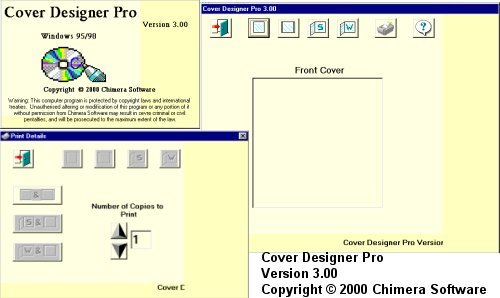



## Cover Designer Pro 3\.00

### Description

If you've been to any of the CD cover sites you've probably seen a program called CoverPro designed by Jerry Wang, his program only allows you to print the front and back cover. I got bored one day so decided to see if I could make anything better. This code proves I can. You can print the front cover, Back cover, front & inside cover (made up of 2 images) or the front and inside cover (made up of 1 image), there is also a load of print options to print combos etc. I also included ALL the graphics used as when I last used a resouce file I had complaints that no one could edit them (DUH that's the point of using resource files)
 
### More Info
 
Images to print

Unzip the file by right clicking it, that way the graphics files will be in the right folders

Printed covers

None that I know of

             |
---                |---
**Submitted On**   |2000-04-28 17:07:48
**By**             |[N/A](https://github.com/Planet-Source-Code/PSCIndex/blob/master/ByAuthor/empty.md)
**Level**          |Intermediate
**User Rating**    |5.0 (10 globes from 2 users)
**Compatibility**  |VB 5\.0, VB 6\.0
**Category**       |[Complete Applications](https://github.com/Planet-Source-Code/PSCIndex/blob/master/ByCategory/complete-applications__1-27.md)
**World**          |[Visual Basic](https://github.com/Planet-Source-Code/PSCIndex/blob/master/ByWorld/visual-basic.md)
**Archive File**   |[CODE\_UPLOAD53124282000\.zip](https://github.com/Planet-Source-Code/cover-designer-pro-3-00__1-7669/archive/master.zip)

### API Declarations

Only a few for the registry and effects

